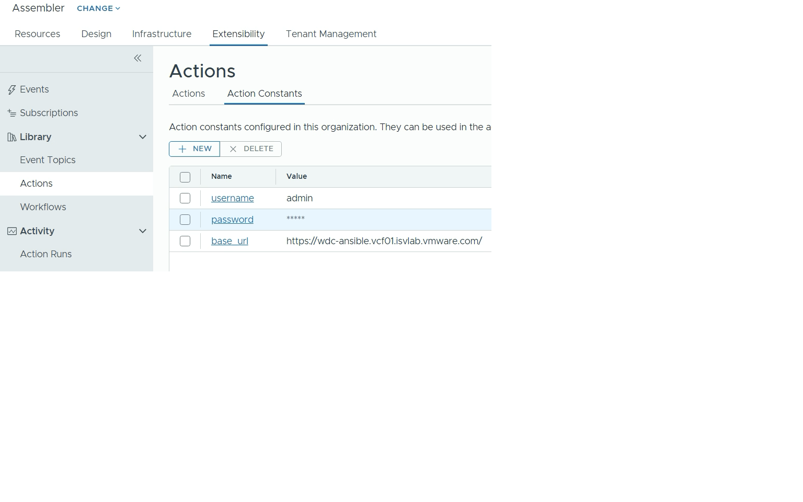
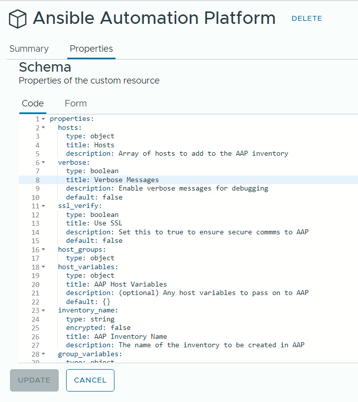

# AAP-API
VMware Aria Automation action to implement custom resources to interface with Ansible Automation Platform. These actions and custom resources implement a more complete interface. 

- Create inventories with more than one host
- Create groups and add hosts to 0 or more groups
- Create inventory variables
- Create group variables
- Create host variables
- Invoke a job with an inventory
- Wait and poll on the job status

## Deployment
This section outlines the steps to deploy and configure the Ansible Automation Platform API in Aria Automation Assembler. These steps are based and tested on Aria Automation 8.16. 

### Actions`

For the simplest installation, follow the instructions below. 

It is also possible to clone the repository and add sync via the 'integration > github' facility in the infrastructure section of aria automation (see [Using Automation Assembler](https://docs.vmware.com/en/VMware-Aria-Automation/SaaS/Using-Automation-Assembler/GUID-86778362-8C3B-4276-9F83-33E320EC960E.html)). 

1. In Aria Automation Assembler, open **Extensibility**, then select **Actions**.
   <br>
   <br>
   


2. Select **New**, and fill out the following fields:
   <br>
   <br>
   
   * Name: aap_api
   * Project: ***\<select the project for the action\>***


3. In the new action:
   <br>
   <br>
   
   * Select **Python 3.10**
   * Select **Write Script**
   * Copy and paste the aap_api.py code in the code section.


4. In the new action:
   <br>
   <br>
   
   * Set the main function to **handler** 
   * In the **Dependancy** enter the following:
     * ***requests***
   * Leave the **FaaS provider** as ***Auto Select***
   

5. Repeat steps 1 to 4 for the following actions. 
   <br>
   <br>
   
   * ***aap_api.py***
   * ***aap_read.py***
   * ***aap_delete.py***


### Action Constants

This adds the url and credentials that are used when the aap_api actions run.

1. Under  **Extensibility**, then **Actions Constants**.
   <br>
   <br>
   


2. Add the following parameters:
   * ***username***: user defined in Ansible Automation Platform
   * ***password***: password for the user
   * ***base_url***: url of the Ansible Automation Platform server


### Custom Resources

1. In Aria Automation Assembler, open **Design**, then select **Custom Resources**. 
   <br>
   <br>
   


2. Select **New**, and enter the following:
   <br>
   <br>
   
   * Name: ***Ansible Automation Platform*** 
   * Resource Type: ***custom.api.ansible_automation_platform***
   * Activate: ***enabled***
   * Scope: ***\<as required\>***
   * Based on: ***ABX user defined schema*** 
   

3. Scroll down to the **Lifecycle Actions** and select the ABX actions previously created, then click **Create**.
   <br>
   <br>
   
   * Create: ***aap_api***
   * Read: ***aad_read***
   * Destroy: ***aap_delete***


4. Select the **Properties** tab and create the following properties.
   <br>
   <br>
   
```yaml
properties:
  hosts:
    type: object
  verbose:
    type: boolean
  ssl_verify:
    type: boolean
  host_groups:
    type: object
  host_variables:
    type: object
    default: {}
  inventory_name:
    type: string
    encrypted: false
  group_variables:
    type: object
    default: {}
  job_template_name:
    type: string
  organization_name:
    type: string
  inventory_variables:
    type: object
    default: {}
```

5. The **Custom Resources** lists the newly created resource.
   <br>
   <br>
   

   
## Usage
This section describes the AAP_API custom resource variables, and how to use them.

```yaml
resources:
  Custom_api_ansible_automation_platform_1:
    type: Custom.api.ansible_automation_platform
    properties:
      base_url: ${propgroup.aap01_home_lab.server}
      username: ${propgroup.aap01_home_lab.username}
      password: ${propgroup.aap01_home_lab.password}
      ssl_verify: ${propgroup.aap01_home_lab.ssl}
      verbose: true
      organization_name: Default
      job_template_name: CRDB Template
      inventory_name: ${env.deploymentId}
      inventory_variables:
        use_ssl: true
        lb_address:
          - ${resource.web_lb.address}
      hosts:
        - ${resource.vm-1.*}
        - ${resource.vm-2.*}
        - ${resource.vm-3.*}
      group_variables:
        group1:
          sql_port: 26257
          rpc_port: 26357
        group2:
           service_name: cockroachdb
      host_variables:
        crdb-vm:
          rack: 1
          verbose: true
      host_groups:
        group1:
          - ${resource.vm-1.*}
        group2:
          - ${resource.vm-2.*}
        group3:
          - ${resource.vm-1.*}
          - ${resource.vm-2.*}
```

