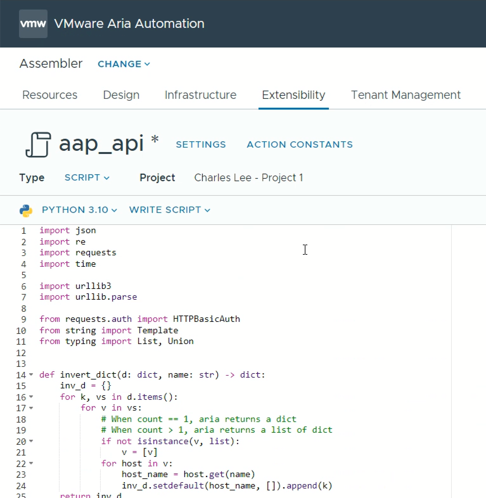
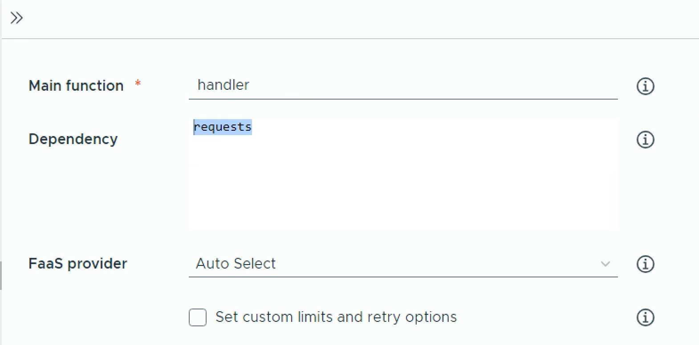

# AAP-API
VMware Aria Automation action to implement custom resources to interface with Ansible Automation Platform. These actions and custom resources implement a more complete interface. 

- Create inventories with more than one host
- Create groups and add hosts to 0 or more groups
- Create inventory variables
- Create group variables
- Create host variables
- Invoke a job with an inventory
- Wait and poll on the job status

## Installation

Note: These instructions are based and tested on Aria Automation 8.16. 

### Actions

NB: For the simplest installation, follow the instructions below. It is also possible to clone the repository and add sync via the 'integration > github' facility in the infrastructure section of aria automation (see https://docs.vmware.com/en/VMware-Aria-Automation/SaaS/Using-Automation-Assembler/GUID-86778362-8C3B-4276-9F83-33E320EC960E.html) 

1. In Aria Automation Assembler, open **Extensibility**, then select **Actions**.

   


2. Select **New**, and fill out the following fields:
   * Name: aap_api
   * Project: ***\<select the project for the action\>***

   


3. In the new action:
   * Select **Python 3.10**
   * Select **Write Script**
   * Copy and paste the aap_api.py code in the code section.

   


4. In the new action:
   * Set the main function to **handler** 
   * In the **Dependancy** enter the following:
     * ***requests***
   * Leave the **FaaS provider** as ***Auto Select*** 

   
 

5. Repeat steps 1 to 4 for the following actions. 
   * ***aap_api.py***
   * ***aap_read.py***
   * ***aap_delete.py***
   
   


### Action Constants

This adds the url and credentials which is consumed when the aap_api runs

1. Under  **Extensibility**, then **Actions Constants**.

2. Add the folowing parameters:
   * ***username*** <--- a user defined in ansible, which has the correct access
   * ***password*** <--- password for the user
   * ***base_url*** <--- url to the aap 


### Custom Resources

1. In Aria Automation Assembler, open **Design**, then select **Custom Resources**. 

   


2. Select **New**, and enter the following:
   * Name: ***Ansible Automation Platform*** 
   * Resource Type: ***custom.api.ansible_automation_platform***
   * Activate: ***enabled***
   * Scope: ***\<as required\>***
   * Based on: ***ABX user defined schema***
   
   


3. Scroll down to the **Lifecycle Actions** and select the ABX actions previously created, then click **Create**.
   * Create: ***aap_api***
   * Read: ***aad_read***
   * Destroy: ***aap_delete***
   
   


4. The **Custom Resources** lists the newly created resource.
   
    


## Configuration

### Secret
In this step, we store the password for the account that will be used on the Ansible Automation Platform. Storing the password in the secrets eliminates the need to use or store the password in cleartext.

1. In Aria Automation Assembler, open **Infrastructure**, select **Secret**, then select **New**."

   


2. On the **Create Secret** window, enter the following:
   * Name: ***\<user_at_hostname\>*** (or any other appropriate name)
   * Scope: ***Organization*** (or select a specific project)
   * Value: ***\<the password\>***
   
   


3. The new entry appears listed in the secrets.
   
   


### Property Groups
In this step, we create a property group with the all parameters needed to connect to the Ansible Automation Platform. Using a property group makes is easier to reuse blueprints and reduces the risk of typos.

1. In Aria Automation Assembler, open **Design**, select **Property Groups**, then select **New**."
   
   


2. On the new property groups, select and enter the following:
   * Property Group Type: ***Constant Values***
   * Name: ***\<name for the group\>***
   * Scope: ***disabled***
   * Project: ***\<select the project with the password secret\>***
   
   


3. At the **Properties**, click **New Property**.
   
   


4. At the **Properties**, click **New Property**, enter the following, then click **Create**.
   * Name: ***server***
   * Type: ***String***
   * Constant value: ***\<the hostname or IP of the ansible automation platform server\>***
   
   


5. At the **Properties**, click **New Property**, enter the following, then click **Create**.
   * Name: ***username***
   * Type: ***String***
   * Constant value: ***\<the username on the ansible automation platform server\>***
   
   


6. At the **Properties**, click **New Property**, enter the following, then click **Create**.
   * Name: ***ssl***
   * Type: ***Boolean***
   * Constant value: ***\<check if SSL validation is required, uncheck if SSL validation not required\>***
   
   


7. At the **Properties**, click **New Property**, enter the following, then click **Create**.
   * Name: ***ssl***
   * Type: ***Boolean***
   * Constant value: ***\<check if SSL validation is required, uncheck if SSL validation not required\>***
   
   


8. At the **Properties**, click **New Property**, enter the following, then click **Create**.
   * Name: ***password***
   * Type: ***String***
   * Select Type: ***Secret***
   * ***Select the appropriate secret from the list***
   
   


9. At the **Properties**, click **Create**.
   
   


10. The new property groups is listed and available.
   
    


## Usage

```yaml
resources:
  Custom_api_ansible_automation_platform_1:
    type: Custom.api.ansible_automation_platform
    properties:
      base_url: ${propgroup.aap01_home_lab.server}
      username: ${propgroup.aap01_home_lab.username}
      password: ${propgroup.aap01_home_lab.password}
      ssl_verify: ${propgroup.aap01_home_lab.ssl}
      verbose: true
      organization_name: Default
      job_template_name: CRDB Template
      inventory_name: ${env.deploymentId}
      inventory_variables:
        use_ssl: true
        lb_address:
          - ${resource.web_lb.address}
      hosts:
        - ${resource.vm-1.*}
        - ${resource.vm-2.*}
        - ${resource.vm-3.*}
      group_variables:
        group1:
          sql_port: 26257
          rpc_port: 26357
        group2:
           service_name: cockroachdb
      host_variables:
        crdb-vm:
          rack: 1
          verbose: true
      host_groups:
        group1:
          - ${resource.vm-1.*}
        group2:
          - ${resource.vm-2.*}
        group3:
          - ${resource.vm-1.*}
          - ${resource.vm-2.*}
```

